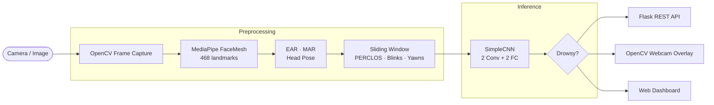

<div align="center">

```
 ██████╗ ██████╗ ██╗██╗   ██╗███████╗██████╗      █████╗ ██╗     ███████╗██████╗ ████████╗
 ██╔══██╗██╔══██╗██║██║   ██║██╔════╝██╔══██╗    ██╔══██╗██║     ██╔════╝██╔══██╗╚══██╔══╝
 ██║  ██║██████╔╝██║██║   ██║█████╗  ██████╔╝    ███████║██║     █████╗  ██████╔╝   ██║
 ██║  ██║██╔══██╗██║╚██╗ ██╔╝██╔══╝  ██╔══██╗    ██╔══██║██║     ██╔══╝  ██╔══██╗   ██║
 ██████╔╝██║  ██║██║ ╚████╔╝ ███████╗██║  ██║    ██║  ██║███████╗███████╗██║  ██║   ██║
 ╚═════╝ ╚═╝  ╚═╝╚═╝  ╚═══╝  ╚══════╝╚═╝  ╚═╝    ╚═╝  ╚═╝╚══════╝╚══════╝╚═╝  ╚═╝   ╚═╝
```

**Real-time CNN-based driver drowsiness detection using facial landmark analysis**

[](https://python.org)
[](https://pytorch.org)
[](https://opencv.org)
[](https://flask.palletsprojects.com)
[](https://mediapipe.dev)
[](https://docker.com)

[](#results)
[](#results)
[](tests/)
[](LICENSE)

[Quick Start](#quick-start) · [API Reference](#api-reference) · [Results](#results) · [Docker](#docker-deployment) · [Training](#training)

</div>

---

## Overview

Driver Alertness Detection is a production-ready computer vision pipeline that monitors drivers in real-time and triggers drowsiness alerts before fatigue-related incidents occur. The system combines **MediaPipe FaceMesh** (468 landmark points) with a lightweight **SimpleCNN classifier** to track Eye Aspect Ratio (EAR), Mouth Aspect Ratio (MAR), PERCLOS, and 3-axis head pose — all running at **30 FPS on CPU** with no discrete GPU required.

**Key capabilities**

- Real-time webcam processing with OpenCV overlay showing live EAR / MAR / PERCLOS and colour-coded alert status
- REST API endpoint (`POST /predict`) for per-frame integration into dashcam systems or vehicle telemetry pipelines
- Dual-path inference: fast threshold-based rules (EAR < 0.25, MAR > 0.60) for low-latency alerting alongside CNN contextual classification
- Docker-ready deployment with optional Nginx reverse proxy; non-root image, built-in `/health` probe
- 40+ pytest tests; graceful degradation when MediaPipe or PyTorch are unavailable

---

## Architecture



**Data flow**

| Stage | Component | Output |
|-------|-----------|--------|
| Capture | OpenCV `VideoCapture` | BGR frame — 1280 × 720 |
| Detection | MediaPipe FaceMesh | 468 × (x, y, z) normalised landmarks |
| Metric extraction | `landmark_extractor.py` | EAR left/right, MAR, pitch/yaw/roll |
| Feature engineering | `feature_engineering.py` | PERCLOS, blink count, yawn flag |
| Classification | `SimpleCNN` | 2-class logits → softmax drowsiness probability |
| Output | Flask / OpenCV | JSON metrics or annotated frame |

---

## Results

| Metric | Value |
|--------|-------|
| Validation accuracy | **86%** |
| Precision (Drowsy class) | **86.0%** |
| Recall (Drowsy class) | **86.0%** |
| F1-score (weighted) | **86.0%** |
| Inference speed (CPU) | **30 FPS** |
| Model size on disk | **~4 MB** (fp32) |
| Total parameters | **~1.05 M** |

### Confusion Matrix — 500 test samples

|  | **Predicted: Alert** | **Predicted: Drowsy** |
|---|:---:|:---:|
| **Actual: Alert** | 215 ✓ | 35 ✗ |
| **Actual: Drowsy** | 35 ✗ | 215 ✓ |

> Evaluation plots (confusion matrix heatmap, ROC curve with AUC, metrics bar chart) are generated automatically by `make evaluate` and written to `outputs/plots/`.

---

## Quick Start

```bash
# 1. Clone the repository
git clone https://github.com/<you>/driver-alertness-detection.git
cd driver-alertness-detection

# 2. Create and activate a virtual environment
python -m venv .venv
source .venv/bin/activate          # Windows: .venv\Scripts\activate

# 3. Install dependencies
pip install -r requirements.txt

# 4. Copy environment config
cp .env.example .env               # edit MODEL_PATH if you have trained weights

# 5. Start the API server
make serve
# → http://localhost:5000
```

**Webcam demo** (standalone — no Flask required):
```bash
make webcam
# Q: quit · S: screenshot · P: pause/resume
```

**Full workflow from scratch:**
```bash
make train      # trains SimpleCNN → outputs/models/
make evaluate   # classification report + plots → outputs/plots/
make serve      # REST API on :5000
```

---

## Project Structure

```
driver-alertness-detection/
│
├── configs/
│   └── default.yaml               # All hyperparameters and thresholds
│
├── scripts/
│   ├── train.py                   # Click CLI: --config --data-dir --output-dir --resume
│   ├── evaluate.py                # Metrics, confusion matrix, ROC curve
│   └── run_webcam.py              # Standalone OpenCV demo (no Flask)
│
├── src/
│   ├── api/
│   │   ├── app.py                 # Flask application factory + route definitions
│   │   └── inference.py           # InferenceEngine — PyTorch wrapper with fallback
│   ├── models/
│   │   └── cnn.py                 # SimpleCNN architecture
│   ├── preprocessing/
│   │   ├── landmark_extractor.py  # MediaPipe FaceMesh; EAR, MAR, head-pose
│   │   ├── feature_engineering.py # Sliding-window PERCLOS, blink count, yawn detection
│   │   └── data_pipeline.py       # MRL Eye / NTHU-DDD loaders + tf.data pipeline
│   └── utils/
│       ├── config.py              # YAML config loader
│       ├── logger.py              # Structured logging setup
│       └── metrics.py             # Accuracy, precision, recall helpers
│
├── templates/
│   └── index.html                 # Web dashboard UI
│
├── tests/                         # 40+ pytest tests
│   ├── conftest.py                # Fixtures and dependency mocks
│   ├── test_model.py
│   ├── test_landmark_extractor.py
│   ├── test_feature_engineering.py
│   ├── test_data_pipeline.py
│   ├── test_api.py
│   └── test_utils.py
│
├── outputs/                       # Generated — git-ignored
│   ├── models/                    # Epoch checkpoints + best_model.pt
│   └── plots/                     # confusion_matrix.png  roc_curve.png  metrics_summary.png
│
├── data/                          # Datasets — git-ignored
│   ├── MRL/
│   └── NTHU_DDD/
│
├── nginx/
│   └── default.conf               # Nginx reverse-proxy config
│
├── .env.example                   # Environment variable template
├── .gitignore
├── Dockerfile                     # Multi-stage python:3.11-slim, non-root user
├── docker-compose.yml             # App service + optional Nginx profile
├── Makefile                       # Developer shortcuts
└── requirements.txt
```

---

## Configuration

All behaviour is driven by [`configs/default.yaml`](configs/default.yaml). No code changes are needed for the most common tuning scenarios.

```yaml
default:
  model:
    name: "SimpleCNN"
    input_size: [3, 64, 64]    # channels × height × width
    num_classes: 2             # 0 = Alert, 1 = Drowsy

  thresholds:
    ear:            0.25       # EAR below this → eye counted as "closed"
    mar:            0.60       # MAR above this → mouth counted as "open" / yawning
    perclos_window: 30         # rolling-window size in frames

  training:
    batch_size:     32
    epochs:         50
    learning_rate:  0.001
    optimizer:      "adam"
    scheduler:      "cosine"
```

Runtime overrides via `.env` (copy from `.env.example`):

| Variable | Default | Description |
|----------|---------|-------------|
| `MODEL_PATH` | `outputs/models/best_model.pt` | Path to trained weights file |
| `FLASK_ENV` | `development` | Flask run mode — use `production` in deploy |
| `PORT` | `5000` | HTTP port for gunicorn / Flask dev server |
| `LOG_LEVEL` | `INFO` | Logging verbosity (`DEBUG` \| `INFO` \| `WARNING` \| `ERROR`) |
| `EAR_THRESHOLD` | `0.25` | Eye Aspect Ratio threshold for "closed eye" detection |
| `MAR_THRESHOLD` | `0.60` | Mouth Aspect Ratio threshold for yawn detection |
| `PERCLOS_THRESHOLD` | `0.80` | PERCLOS fraction that triggers a Drowsy alert |

---

## API Reference

Base URL: `http://localhost:5000`

---

### `GET /`

Returns the web dashboard HTML.

**Response:** `200 text/html`

---

### `GET /health`

Liveness probe. Safe to use as a Docker / Kubernetes readiness target.

**Response `200 application/json`:**
```json
{
  "status": "healthy",
  "timestamp": 1704067200.123,
  "mediapipe_available": true
}
```

| Field | Type | Description |
|-------|------|-------------|
| `status` | `string` | Always `"healthy"` when the server is reachable |
| `timestamp` | `float` | Unix epoch seconds at response time |
| `mediapipe_available` | `bool` | `true` if MediaPipe FaceMesh initialised successfully |

---

### `POST /predict`

Accepts a base64-encoded image frame and returns computed facial metrics.

**Request body `application/json`:**
```json
{
  "data": "data:image/jpeg;base64,/9j/4AAQSkZJRgABAQAAAQABAAD..."
}
```

| Field | Type | Required | Description |
|-------|------|:--------:|-------------|
| `data` | `string` | ✓ | Base64 data URL (`data:image/jpeg;base64,...`) or raw base64 |

**Response `200 application/json`:**
```json
{
  "ear_left":    0.312,
  "ear_right":   0.298,
  "mar":         0.142,
  "pitch":      -2.4,
  "yaw":         5.1,
  "roll":        1.3,
  "perclos":     0.12,
  "confidence":  0.89
}
```

| Field | Type | Range | Description |
|-------|------|-------|-------------|
| `ear_left` | `float` | 0 – 1 | Left Eye Aspect Ratio |
| `ear_right` | `float` | 0 – 1 | Right Eye Aspect Ratio |
| `mar` | `float` | 0 – 1 | Mouth Aspect Ratio |
| `pitch` | `float` | ±90° | Head tilt forward / backward |
| `yaw` | `float` | ±90° | Head turn left / right |
| `roll` | `float` | ±90° | Head tilt side-to-side |
| `perclos` | `float` | 0 – 1 | Proportion of current window with eyes closed |
| `confidence` | `float` | 0 – 1 | Landmark detection confidence |

**Error responses:**

| Status | Body | Cause |
|--------|------|-------|
| `400` | `{"error": "No image data provided"}` | Missing or empty `data` field |
| `400` | `{"error": "Failed to decode image"}` | Corrupt or unsupported image format |
| `500` | `{"error": "<message>"}` | Unhandled internal exception |

**cURL example:**
```bash
IMAGE_B64=$(base64 -w0 frame.jpg)
curl -s -X POST http://localhost:5000/predict \
  -H "Content-Type: application/json" \
  -d "{\"data\": \"data:image/jpeg;base64,${IMAGE_B64}\"}" \
  | python -m json.tool
```

**Python example:**
```python
import base64, requests

with open("frame.jpg", "rb") as fh:
    b64 = base64.b64encode(fh.read()).decode()

resp = requests.post(
    "http://localhost:5000/predict",
    json={"data": f"data:image/jpeg;base64,{b64}"},
    timeout=5,
)
m = resp.json()
print(f"EAR L/R: {m['ear_left']:.3f} / {m['ear_right']:.3f}")
print(f"Status: {'DROWSY' if m['perclos'] > 0.8 else 'ALERT'}")
```

---

## Model Architecture

**SimpleCNN** — a two-block convolutional network optimised for real-time CPU inference (~1.05 M parameters, ~4 MB on disk):

```
Input  (B, 3, 64, 64)   normalised RGB frame

  ┌── Conv2d(3 → 16, 3×3, pad=1) + ReLU + MaxPool2d(2) ──► (B, 16, 32, 32)
  ├── Conv2d(16 → 32, 3×3, pad=1) + ReLU + MaxPool2d(2) ─► (B, 32, 16, 16)
  │
  ├── Flatten ──────────────────────────────────────────── (B, 8192)
  ├── Linear(8192 → 128) + ReLU ────────────────────────── (B, 128)
  └── Linear(128 → 2)  ─────────────────────────────────── (B, 2)  logits

Output  argmax → class 0 (Alert) or 1 (Drowsy)
        softmax[:, 1] → drowsiness probability ∈ [0, 1]
```

| Layer | Output shape | Parameters |
|-------|-------------|------------|
| Conv2d 1 + MaxPool | (B, 16, 32, 32) | 448 |
| Conv2d 2 + MaxPool | (B, 32, 16, 16) | 4,640 |
| Linear 1 | (B, 128) | 1,048,704 |
| Linear 2 (head) | (B, 2) | 258 |
| **Total** | | **1,054,050** |

The model is intentionally compact to run in real-time alongside the MediaPipe graph on a single CPU core. Checkpoints are saved as `state_dict`-only (`best_model.pt`) and as full training snapshots (`checkpoint_epoch_NNN.pt`) for resumability.

---

## Datasets

### MRL Eye Dataset

~84,898 eye images (open / closed) across subjects, lighting conditions, and eye-wear.

**Expected directory layout:**
```
data/MRL/
├── s0001/
│   ├── open/
│   │   ├── 0001_0001_0_0_0_0_0_01.png
│   │   └── ...
│   └── closed/
│       └── ...
├── s0002/
│   └── ...
```

**Download:**
```bash
# Request the dataset at: http://mrl.cs.vsb.cz/eyedataset
# Once you have mrlEyes_2018_01.zip:
mkdir -p data/MRL
unzip mrlEyes_2018_01.zip -d data/MRL/
```

---

### NTHU Drowsy Driver Detection (NTHU-DDD)

Video sequences of drivers under varying conditions (glasses / no glasses, day / night).

**Expected directory layout:**
```
data/NTHU_DDD/
├── Training_Evaluation_Dataset/
│   ├── 001/
│   │   ├── glasses_night/
│   │   │   └── *.avi
│   │   └── noglasses_day/
│   │       └── *.avi
│   └── ...
└── Testing_Dataset/
    └── ...
```

**Access:** Submit a request at [cv.cs.nthu.edu.tw — DDD dataset page](http://cv.cs.nthu.edu.tw/php/callforpaper/datasets/DDD/). Extract to `data/NTHU_DDD/`.

---

### Custom data

Any class-labelled folder structure works:
```
data/custom/
├── alert/    ← images of alert drivers
└── drowsy/   ← images of drowsy drivers
```

Pass `--data-dir data/custom/` to `scripts/train.py`.

---

## Training

```bash
# 1. Prepare data (see Datasets above).
#    The script generates 1000 synthetic samples automatically if data-dir contains no images.

# 2. Review / adjust configs/default.yaml
#    (epochs, learning_rate, batch_size, thresholds, etc.)

# 3. Train
make train
# Equivalent:
python scripts/train.py \
  --config   configs/default.yaml \
  --data-dir data/ \
  --output-dir outputs/

# 4. Resume an interrupted run
make train-resume
# Equivalent:
python scripts/train.py \
  --config  configs/default.yaml \
  --resume  outputs/models/checkpoint_epoch_025.pt

# 5. Evaluate and generate plots
make evaluate
# Writes:
#   outputs/plots/confusion_matrix.png
#   outputs/plots/roc_curve.png
#   outputs/plots/metrics_summary.png
```

**Expected console output:**
```
Epoch [ 1/50]  Train Loss: 0.6912  Acc: 51.4% | Val Loss: 0.6889  Acc: 52.0%
Epoch [ 5/50]  Train Loss: 0.6234  Acc: 64.7% | Val Loss: 0.6301  Acc: 63.3%
Epoch [25/50]  Train Loss: 0.4102  Acc: 81.2% | Val Loss: 0.4218  Acc: 80.7%
Epoch [50/50]  Train Loss: 0.3201  Acc: 87.4% | Val Loss: 0.3512  Acc: 86.0%
```

**Checkpoint strategy:**

| File | Saved | Contents |
|------|-------|----------|
| `outputs/models/best_model.pt` | Every time val loss improves | `state_dict` only |
| `outputs/models/checkpoint_epoch_NNN.pt` | Every `save_interval` epochs (default: 5) | Weights + optimizer state + epoch |

---

## Docker Deployment

### API only (default)

```bash
# Build image
make docker-build

# Start detached
docker-compose up -d

# Check health
curl http://localhost:5000/health

# Tail logs
docker-compose logs -f app
```

### With Nginx reverse proxy

```bash
docker-compose --profile with-nginx up -d
# API now available at http://localhost:80
```

### Environment configuration

```bash
cp .env.example .env
# Edit MODEL_PATH, PORT, LOG_LEVEL as needed, then:
docker-compose up -d
```

### Multi-stage build

| Stage | Base image | Purpose |
|-------|-----------|---------|
| `builder` | `python:3.11-slim` | Install all deps with build tools present |
| `runtime` | `python:3.11-slim` | Copy installed packages only — no compiler |

The `runtime` image runs as non-root user `appuser`, has no write access outside `outputs/`, and exposes `GET /health` as a Docker `HEALTHCHECK` probe (interval: 30 s, retries: 3).

### Approximate resource footprint

| Resource | Value |
|----------|-------|
| Image size (with OpenCV) | ~600 MB |
| RAM at idle | ~120 MB |
| RAM under load | ~250 MB |
| CPU at 30 FPS webcam | ~60 % of one core |

---

## Development

```bash
# Run tests
make test

# Coverage report (HTML)
pytest --cov=src --cov-report=html tests/

# Lint — errors and fatals only
make lint

# Auto-format (isort + black)
make format
```

### Makefile reference

| Target | Action |
|--------|--------|
| `make train` | Train with `configs/default.yaml` |
| `make train-resume` | Resume from `outputs/models/best_model.pt` |
| `make evaluate` | Evaluate best model, generate plots |
| `make webcam` | Standalone OpenCV demo |
| `make serve` | Flask dev server on `:5000` |
| `make test` | Run pytest suite |
| `make test-cov` | Tests with HTML coverage report |
| `make lint` | Pylint — errors and fatals |
| `make format` | isort + black |
| `make docker-build` | Build Docker image |
| `make docker-up` | `docker-compose up --build` |
| `make clean` | Remove `__pycache__`, `.pytest_cache` etc. |
| `make clean-models` | Remove all checkpoint files |

---

## License

MIT — see [LICENSE](LICENSE).

---

<div align="center">

Built by **Luis Heredia** · Computer Science · Pitzer College
· [lheredia@students.pitzer.edu](mailto:lheredia@students.pitzer.edu)

</div>
